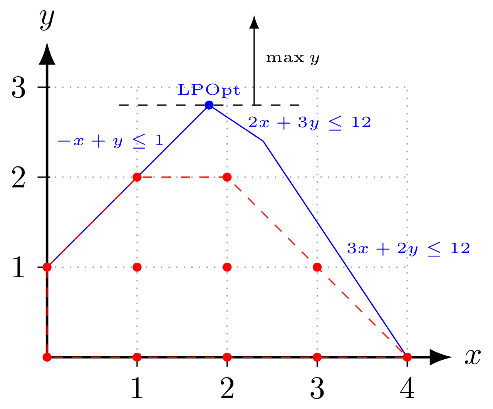
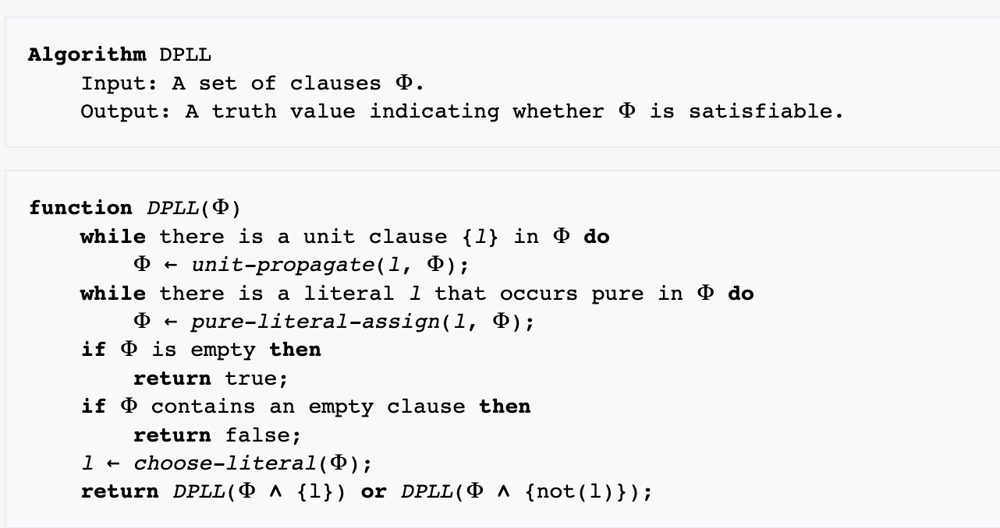

# Other (more specific) kinds of solvers and encodings
Why talk about these?  
- To give you an idea of what's out there, and different kinds of encodings.  
- To give you something to compare to

We will talk about:
- **Integer programs** <<
- SAT solvers
- Stochastic and local search (next time)

And how we might compare the performance of different solvers or techniques.

# Integer programming
We have in a sense already done some integer programming, just encoded as CSPs in MiniZinc style.

An integer program is a mathematical optimization in which the variables are integers (if you've seen linear programming before, it's a linear program where we retrict variables to integer values)
- often people actually mean integer *linear* programming where the constraints are linear
- if some of the variables are not integers, we have *mixed-integer* programming (MIP)
- if the integer domains are restricted to subsets of $\{0, 1\}$ then zero-one or binary integer programming

## How do we encode a problem as an ILP? 

Learn by examples.

### Knapsack example
We are a child running away from home, and are packing a knapsack of snacks. Each snack has a cost in terms of back space (or weight maybe), and a desirability.  We want to optimise our desirability subject to space.  We have:
- $a$pples cost 3 gain 4
- $l$ettuces cost 7 gain 2
- $c$arrots cost 4 gain 2

So we want to maximize:
- $4a + 2l + 2c$
subject to:
- $3a + 7l + 4c \leq$ capacity

### Graph colouring example
We have a graph $G = (V, E)$ and we want to colour it with a minimum number of colours. We need a number of variables and constraints.

(Boolean) Variables:
- For each vertex $i$, colour $j$
    - $c_{i,j}$ is 1 if integer $i$ is colour $j$, $0$ otherwise
    - $w_j$ is $1$ if we use colour $j$, $0$ otherwise
- domain of $i$ is vertices, $j$ is colours

Objective function:
- $min \sum_{j}w_j$

Subject to constraints:
- Every node gets exactly one colour:
    - $\forall i \in V$ $\sum_{j}c_{i,j} = 1$
- Every edge has different coloured ends
    - $\forall (u, v) \in E, j \in C$   $x_{u,j} + x_{v,j} \leq 1$
- We record when we use a colour
    - $\forall i \in V, j \in C$ $x_{i, j} \leq w_j$

### A nice example using ORTools
https://colab.research.google.com/drive/1Gxt_sBVOZAaUo_LNvz60e1BacJ_azivs?usp=sharing

Adapted from:
Blog post: https://phabe.ch/2023/08/07/vertex-coloring-using-ilp/

That's from a student who was taking a course at Bonn - the deep-dive notes on that section are here if you're interested:  https://www.or.uni-bonn.de/~held/hausdorff_school_22/slides/GraphColoringFormulations.pdf

And if you're *really* keen here's a related paper:  https://arxiv.org/pdf/1706.10191

### A PuLP in Python example
https://colab.research.google.com/drive/1_PIERNAIiQbVuDekkfdIkLQGtY2-dm4m?usp=sharing

### An ILP for Firefighting
Firefighting problem:  A fire breaks on on a graph $G = (V, E)$ at vertex $r$.  On each turn we get to defend $d$ vertices. Then the fire spreads to all non-burning non-defended vertices that are adjacent to a burning vertex.  Burning vertices burn forever, defended vertices are defended forever.
Questions: 
- Decision version: Can we save some specified proportion of the graph (or number of vertices)?
- Optimisation version: What is the maximum number of vertices we can save?

A few resources:
- a classic survey
- a paper about ILP and heuristic techniques on this problem: https://dl.acm.org/doi/10.1016/j.cor.2015.02.004

We can encode this as an ILP

Some notation:
- $G = (V, E)$ is the graph
- $T$ is some maximum time
- $N(x)$ is the neighbourhood of vertex $x$
- we'll use $t$ to denote times
- $r_i$ are the places the fire starts
- $d$ is our budget of defenders

Some variables and how we interpret them:
- $b_{x,t}$ gets $1$ if vertex $x$ is burned at or before $t$, 0 otherwise
- $d_{x,t}$ gets $1$ if vertex $x$ is burned at or before $t$, 0 otherwise

## How do we solve ILPs
In many cases, similar ways to how we solve CPs - branch and bound is popular.  

But there's an additional bit that we can take advantage of: linear relaxations.  A linear relaxation of an integer program is a version of the program where we do not require the variables to be integers (they could instead be real numbers).  
Why would we do this?
- Solving ILPs is NP-hard
- Solving this kind of LPs is polynomial-time

Why does this not solve our problem?
- rounding the relaxation doesn't necessarily give us a solution (the difference is something called the **integrality gap**)

So why is it useful at all?
- the solution to a relaxation can tell us things about possible solutions to the original ILP

In particular, the solution to the relaxation is *as good or better* than the best solution to the ILP: if it's a maximisation it's the same or bigger, if it's a minimisation it the same or smaller.  

Let's look at a picture from wikipedia:

(CC-BY)
Fanosta - Derivative work based on IP polytope with LP relaxation.png by Sdo
Polytopes of all feasible integer points and of the LP relaxation to the integer linear program max $\{ y | -x+y <= 1; 3x + 2y <= 12; 2x + 3y <= 12; x,y \in Z_+ \}$.

(extra things to note: how visible the linear nature of constraints is here)

This bound helps us in pruning during search.  

# SAT solvers
SATisfiability solvers deal specifically in solving prop logical expressions of the sort we've seen in our examples of e.g. 3-CNF-SAT. 

Note that one of the fastest CP solvers around currently is based on a SAT solver: https://developers.google.com/optimization/cp/cp_solver
It does pretty well in the MiniZinc Challenge:
https://www.minizinc.org/challenge.html

Various solver approaches exist, and often combination ones work out the best.  We'll outline a few:

### Davis–Putnam–Logemann–Loveland (DPLL) algorithm

(from Wikipedia)

- Unit propagation is something we can do when a clause has only one literal - it is a *unit clause*.  Then we know that literal must be satisfied, and so we can record that, remove any clause with that literal in it, and remove the negation of the literal from any clause. 
- Pure literal assignment is something we do when a variable only appears as a positive or only as a negative literal.  Then we can assign the value that satisfies that literal and remove any clause with it in. 

### Randomized algorithms
Randomized or probabilistic algorithms (e.g Paturi-Pudlak-Saks-Zane)  are some of the fastest on many types of SAT instance family. We'll not talk much about these, but roughly speaking they set variables in a random order and resolve from there.  The maths showing that these will work is dense, but if you're very keen - this is an option for an 'explainer' video.

e.g.
- https://dl.acm.org/doi/10.1145/1066100.1066101

A few resources:
- (just for interest, not examinable in this course): https://www.youtube.com/watch?v=lY-aJWVTN6s
- (just for interest, not examinable in this course): description of the OR-Tools SAT-based solver(s) https://www.youtube.com/watch?v=lmy1ddn4cyw

# How do we compare methods?

This is really a general question about how to do science around experiments for algorithms.  There is only guidance here.

First, it's a good idea to use an existing benchmark set, or think carefully about how you're generating your instances.  
- almost all instances of hard problems are easy
- most meaningful comparisons of approaches show strengths and weaknesses to each approach, and this often depends on the instances

Next (if we assume they're getting the same solutions, so we're just comparing time):
- we need to do timings on the same machine
- there are lots of weird complications about timings, mostly beyond scope here
- need to account for timeouts somehow

Here's an example of a timing figure that I think is a good template:

