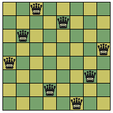
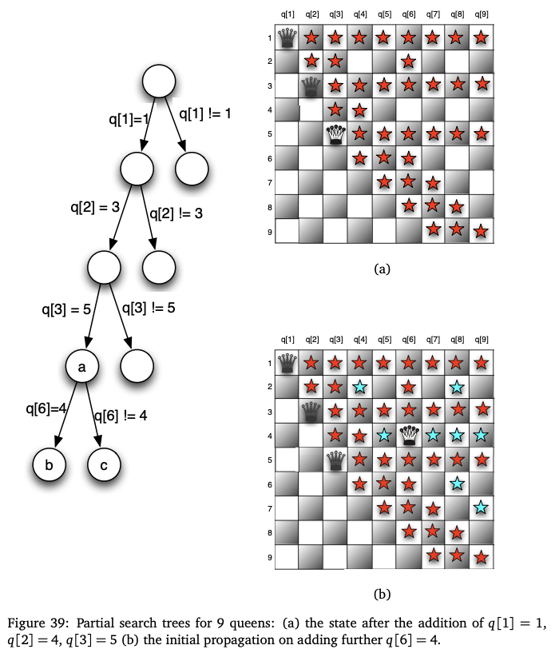

# Global constraints
We've seen at least one of these in action: all-different - now we will talk about them in a bit more.  Ciaran may follow up to talk even more about the nitty-gritty internals.  

Global constraints allow expressing a constraint between a non-fixed number of variables.

**Global constraints** have many advantages, including that they:
- let us express constraints that occur in our models more compactly and intuitively
- may come with special algorithms to compute them more efficiently
- may allow for better inference/propagation (beyond basic arc-consistency)

The plan:
- look at all-different
    - increased expressiveness
    - matching-based algorithm 
- (maybe) look at other global constraints via the MiniZinc catalogue and tutorial (e.g. at http://www.dcs.gla.ac.uk/~pat/cpM/minizincCPM/tutorial/minizinc-tute.pdf)
    - cardinality constraint

## All-different
Remember our requirement from assignment 1 that all arrivals must be on different days?  At least one possible solution used alldifferent.

n-Queens is a classic problem used to introduce alldifferent (and a fun problem!) so we'll discuss it.  

8-queens:

(User:Lee Daniel Crocker - modified by Fispaul at da.wikipedia, CC BY-SA 3.0 <http://creativecommons.org/licenses/by-sa/3.0/>, via Wikimedia Commons)

---
- Input: natural number $n$
- Question: Can we place $n$ queens on an $n \times n$ chessboard so that no two are in the same row, column, or diagonal?
---

Expressing this without all alldifferent is possible but annoying.  With alldifferent it is straightforward in MiniZinc:

(we'll look at an example board in lecture to make sure we understand encoding)
```
int: n;
array [1..n] of var 1..n: X;
include "alldifferent.mzn";
%distinct rows
constraint alldifferent(X); 
 % distinct diagonals upwards
constraint alldifferent([ X[i] + i - 1| i in 1..n]);
 % distinct diagonals downwards
constraint alldifferent([ X[i] - i + 1| i in 1..n]);

solve satisfy;
```
Partial search tree from http://www.dcs.gla.ac.uk/~pat/cpM/minizincCPM/tutorial/minizinc-tute.pdf:  



So hopefully I've convinced you that it's convenient for encoding.  Let's talk inference (in a smaller pseudo-code example):


$x, y, z \in \mathbb{N}$
$D(x) = D(y) = \{1, 2\}$
$D(z) = \{1, 2, 3\}$
`alldifferent(`$x, y, z$)

What can we infer about $z$?
Could we get this from arc consistency if we just had $x\neq y, x \neq z, y \neq z$ as our constraints?


This sort of thing might be familiar to anyone who does sudoku puzzles, and is a powerful thing about alldifferent.  


## Matchings for alldifferent

We want to exclude domain values that are not part of any all-different value assignment.  Luckily, graph theory can help us with **maximum matchings**

Let's visualise our possible assignments as a bipartite graph (that is, a graph with two parts that only has edges between the parts.)
- vertex set of one part is the variables that are alldifferent
- vertex set of other part is possible values
- edge from variable $v$ to value $d$ if $d$ is in $D(v)$:

(will draw out for our small example above)

A maximum matching on a bipartite graph like this is a set of edges such that:
- no two edges share an endpoint
- there are as many edges in this set as possible

If our problem is satisfiable, then there must be a matching that is as large as the set of all-different variables.  

Proof sketch where $V_1$ is set of variables, $V_2$ is set of values:
- satisfiable implies matching:  Take the satisfying assignment $\Phi: V_1 \rightarrow V_2$.  As it is satisfying, we know that $|\Phi| = |V_1|$ and $\Phi(v_i) \neq \Phi(v_j)$ for all $v_i, v_j \in V_1$.  Then take the set of edges $E_M = \{(v, x)\}$ where $v \in V_1$, $x \in V_2$, and $\Phi(v) = x$.  We still need to show that:
    - $|E_M| = |V_1|$
    - $E_M$ are edges in our graph
    - for every pair of edges $(v, x)$ and $(u, z)$ in $E_M$ we have that $v \neq u$ and $x \neq z$
- Let's do the second part together in lecture.

Alright, so we're only interested in edges that are in *some* max matching, but how can we tell that?

Jack Edmonds and Claude Berge can help:


(claim due to Berge, algorithm from Edmonds)
---
- An edge belongs to some but not all maximum matchings if and only if for an arbitrary maximum matching, it belongs to either an even alternating path which begins at a free node, or an even alternating cycle.
---


OK, we've been lazy.  Some definitions:
Let $M$ be a matching. 
- edge in $M$ is a *matching edge*
- every edge not in $M$ is *free*. 
-  node is *matched* if it is incident to a matching edge and *free* otherwise.
-  *alternating path* or *cycle* is a path or cycle whose edges are alternately matching and free.

We'll draw a picture in lecture - possibly a little one and a big one. 

What complexity is this?  Note that you couldn't really work it out without specifying our alternating path algorith - we'll just state it here to consider how fast it is compared with a full search tree.  


If we are enforcing all-different over $k$ variables, and the largest domain over those variables is size $m$, then $O(km\sqrt{k}))$ to get matchings information, which dominates. 

The main thing to notice is that this is much faster than a full search, so likely saves us time.

A few resources:
- https://www.cs.upc.edu/~erodri/webpage/cps//theory/cp/global-constraints/slides.pdf
- https://www.sciencedirect.com/science/article/pii/S1574652606800106
- http://www.constraint-programming.com/people/regin/papers/globalCpaior.pdf

## Global cardinality constraint


http://www.constraint-programming.com/people/regin/papers/globalCpaior.pdf
This is a generalisation of the all-differeny constraint: 
- set of variables $X$ take their values from domain $D$, and constrains the number of times that any value can be assigned to variables within some range.  

Example: remember rota scheduling? we might have some minimum and maximum possible number of people working each night/day shift.  Of course we can do this without a global constraint, but it makes it easier (and faster!) as with all-diff. 

Pulling a code snippet out for the guards rota example:
(full examples and problem description at: https://github.com/magicicada/cp/tree/main/week_by_week/week_3/afternoon_examples/guard_rota)

Without global cardinality:
```
% the number of guards that must be on duty in each shift of each day
array[DAYS] of var lwbDay .. upbDay: totalOnDay;
constraint forall(d in DAYS)(totalOnDay[d] = sum(g in GUARDS)(roster[g,d] = DAY));
array[DAYS] of var lwbNight .. upbNight: totalOnNight;
constraint forall(d in DAYS)(totalOnNight[d] = sum(g in GUARDS)(roster[g,d] = NGT));
```

With:
```
% the number of guards that must be on duty in each shift of each day
array[DAYS] of var lwbDay..upbDay: totalOnDay;
array[DAYS] of var lwbNight..upbNight: totalOnNight;
constraint forall(d in DAYS)(global_cardinality([roster[g,d] | g in GUARDS],[DAY,NGT],[totalOnDay[d],totalOnNight[d]]));
```

# Summary
As a general message: these global special constraints are expressive, and typically faster than rolling your own.  

Try to use them when you can!

https://www.minizinc.org/doc-2.3.0/en/lib-globals.html
