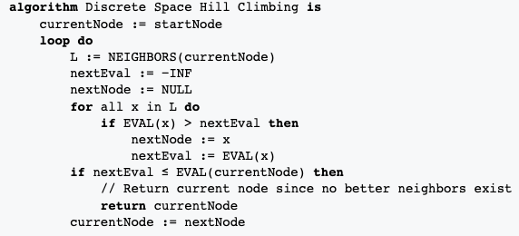
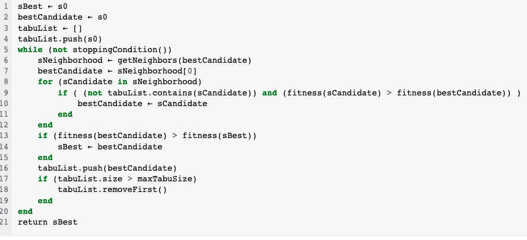

# Local and heuristic-non-optimal searches
So far we've talked about searches that are guaranteed to find an optimal answer (or the correct answer if decision version).

This week we're talking about other kinds of search which in general are fast but not guaranteed to find best-possible answer.

## Local search
The 'local' in local search refers to a local exploration of a search space.

Think about all the possible solutions to one of our problems: e.g. satisfiability problems. Here a possible solution is a set of truth assignments to variables: then a local search might look around 'similar' assignments and gradually try to move toward an overall satisfying assignment.  We need some notion of a 'neighbour' state, and some indication of what is a good or a bad state to help us direct the search.  

If we're talking about truth assignments:
- a neighbour truth assignment might be one with a small number of different assignments, and
- a measure of goodness might be how many clauses are satisfied.

We'll talk about:
- hill climbing
    - we'll mention exhaustive local search at the end if we have time
- simulated annealing
- ant colony algorithms
- Tabu search
- - genetic algorithms


## Hill climbing
Hill climbing is based on the idea that the solution space is like a landscape with better solutions higher up. Hill climbing is like you trying to ascend a hill by always stepping only upwards.

Example: live example with vertex cover


Let's look at some pseudocode (courtesy of Wikipedia):



An important observation: hill climbing will eventually give an optimal answer for a **convex problem** - this is a problem without local maxima. (I'll draw an example squiggly line)

Hill climbing is good at this kind of thing:


But not great at these kinds of things:


Do we think that satisfiability is a convex problem?   We'll try to concoct an example.  Dependent on the 'neighbour' relation and the 'goodness' measure. 

Hill climbing variants (we'll look at little 1D cartoon examples of these):
- steepest-ascent
    - Instead of going to the first 'higher' neighbour, find the most-better neighbour and go there. 
- stochastic
    - Move to a random neighbour with probability related to how much better than neighbour is
- shotgun (random-restart)
    - do a bunch of hill climbing, restarting occasionally.  Keep the best result.

## Simulated annealing
The name comes from metallurgy: heating and cooling a metal to change its characteristics. It's not a lot like it really, but the 'cooling' is the analogy.  


Intuition:
- every state has some 'energy' (and here we look for low-energy states)
- the system has a 'temperature' that determines how easy it is to jump around the system
    - cooler means less jumping
- we gradually 'cool' the system as we continue our search
- we quit when an answer is good enough, or we're not moving, or we run out of computation

Let's look at an intuition-giving animation:
https://en.wikipedia.org/wiki/File:Hill_Climbing_with_Simulated_Annealing.gif

Let's look at some pseudocode:
```
P(energy_1, energy_2, temperature) is the probability of acceptance function
E(s) is the energy of state s

s <-- s_0
for k in [0 .. k_{max}]:
    T <-- temperature schedule at time k
    s_{new} <-- a random neighbour of s
    if P(E(s), E(s_{new}, T) >= random number in (0, 1):
        s <-- s_{new}
return s
        
```
Setting the $P$ and $E$ functions, temperature schedule, as well as the parameters $k_{max}$ is problem-specific. Sometimes the neighbour generation function includes longer jumps as well (helps with escapting local maxima/minima).


Simulated annealing is popular for traveling salesperson (TSP). 


A nice set of examples and visualisations here:  https://www.fourmilab.ch/documents/travelling/anneal/

## Tabu search

Called 'tabu' because we build up sets of things we 'don't touch'. Really it's a family of approaches.

Intuition:
- as with other local searches we generate neighbour states
- build up 'banned' lists of moves that we do not want to consider
    - prevents cycling
- very related to simulated annealing

Let's look at pseudocode (courtesy of wikipedia)


We can get fancier with other kinds of 'memory' lists - but that's a bit beyond what we'll talk about. 

Also suitable for TSP

## Ant colony algorithms
Based on the behaviour of ants when searching for food - specifically for problems that can be phrased as finding a path through a graph.  Simulated ants wander around a parameter/solution space looking for solutions.  The 'ants' lay down little markers indicating where they've found good solutions.  The markers 'evaporate' over time, so shortest paths have more pheromone and attract more ants - feedback cycle ensues.


Some (very) pseudocode:

```
while we're not done:
    put each ant on a starting node
    while an ant hasn't found a solution:
       for each ant:
         move ant to next node using transition rule
         apply the pheromone update
    update the best solution
    do the secondary pheromone update
report the best solution
```

Transition rules and pheromone updates are problem-specific.ß


## Genetic algorithms
Supposedly inspired by evolution in the natural world.

Intuition: given a solution, use genetic operations to generate better solutions.  

We need:
- some genetic-style representation
- a fitness function
- definitions of how we do our mutation, crossover, selection

We maintain a 'population' of solutions.  Then we select for the best by some measure.  Then we mutate or combine them, then we repeat.  
